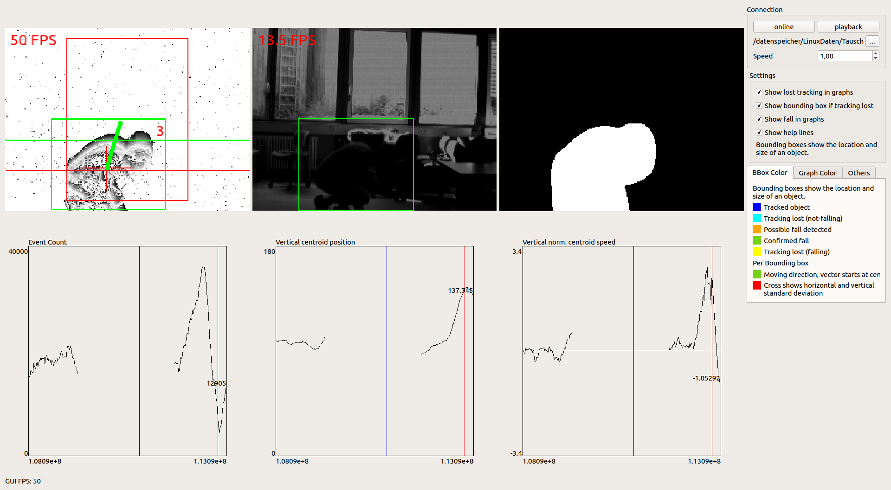
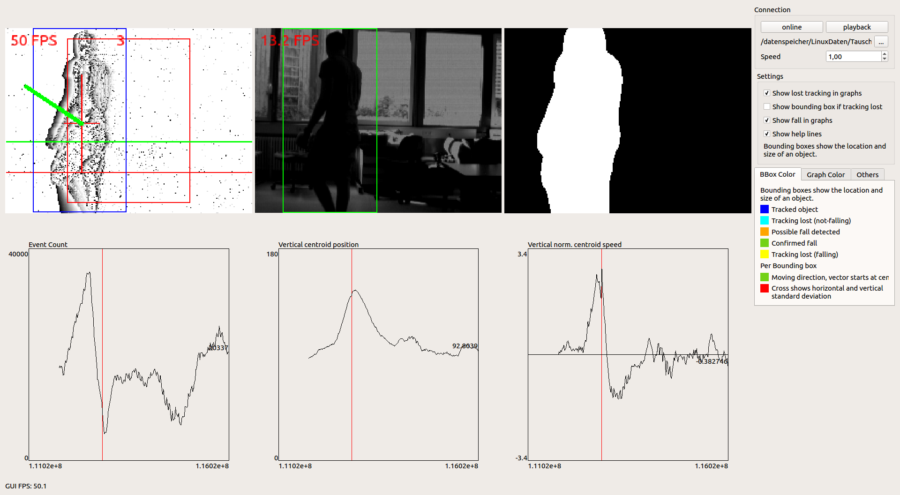
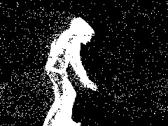
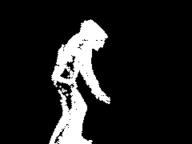
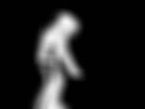
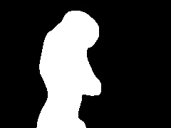

# FallDetectionProject

## Previous Work
This is a computer vision project for University Ulm, Germany. The main goal was to detect falling person with an event based camera system and the basic principal is based on a Paper from Delbruck et al. [1].

Event based cameras don't generate sequenes of full frames but produce an asynchronous stream of events that indicate were the pixel luminance has changed. Because of their highly decreases data rate, these cameras can operate much faster compared to normal cameras and therefore they can be used to detect and analyse fast movements in a scene without motion blurring effects. See also [2] for more information on event based cameras.

Delbruck et al. used such a sensor in their paper to measure the centroid and speed of a moving object (in a fixed temporal window). Depending on the centroids vertical position in the image and the vertical speed, they deteted falling objects with very low power consumption and very high processing rate. To be invariant to varying distances to the camera, the speed estimation is normalized by the estimated object size (2* standard deviation of event locations).

## System Overview
In this project this approach is reimplemented and extended to deal with two major issue with the proposed system:

- The original algorithm expects only a single moving object in the whole scene. Multiple moving objects yield to an incorrectly estimated centroid and speed and therefore fall detection is not possible anymore.
- The original system also reacts to falling objects e.g. balls or boxes which should not be detected.

### Segmentation Stage
To address these issues, the system segments moving objects in the event based camera data by using the following processing steps:

Processing step | Corresponding image
-----|------
Raw Image | 
Morvological Opening | 
Gaussian blurred f(t) | 
Last result g(t-1) | 
Temporal blurred g(t)=0.75*f(t)+0.25*g(t-1) | 
Thresholded | 

Finally the bounding box of all moving objects is extracted and the original computation steps (centroid, speed, standard deviation) are performed for each bounding box seperately. Due to the highly increased influence of noise, the resulting speed estimation has to be highpass filtered over time.
To reduce the false alarm rate, too small objects and objects with too few events are filtered out. To get a more precise speed estimation for fall detection,
the system looks for local maxima in the speed curve. Otherwise, due to the high processing rate, the system always reacts to very fast moving objects because their speed estimation "slowly" reaches their actual value (caused by smoothing). By taking the local maximum, always the peak velocity is used for further calculations.

### Detection Stage
Now an extended classifier is used to detect falling persons. It detects falling objects by concerning the following features:
1. Normalized vertical centroid speed above MIN_FALL_SPEED
2. Normalized vertical centroid speed below MAX_FALL_SPEED
3. Centroid position below MAX_FALL_POS_Y

The used camera is a DAVIS240c from Inilabs [2] and additionally to the asynchronous event stream, it also generates a regular framebased grayscale image.
After a falling objects is detected, a second classifier tries to decides if the object is a falling human. This implementation uses a boosted cascade classifier on the provided grayscale image to detect falling humans which is trained with a recorded training set.

### Parameter Adjustment
To get the maximum performance, a subset of system parameters is optimized by implementing an automatic ROC-curve computation and analysis framework implemented in python. Different parameters values were used and the individual hit and miss rates were computed. This information is then used to generate the ROC curve and different performance measures were used to select the best performing parameter value. Have a look at [this repository](https://github.com/rottaca/FallDetectionProjectEvaluationAndTraining) for the training and evaulation scripts and other tools used for training and evaluating the system.

## References
[1]: Fu, Z., Delbruck, T., Lichtsteiner, P., & Culurciello, E. (2008). An address-event
fall detector for assisted living applications. IEEE Transactions on Biomedical
Circuits and Systems, 2(2), 88-96.

[2]: Inilabs: https://inilabs.com/products/dynamic-vision-sensors/
